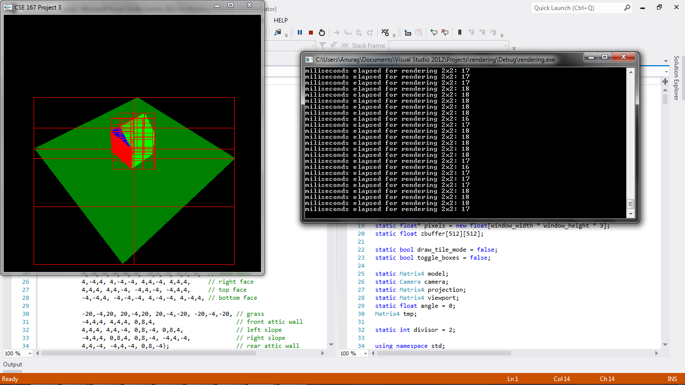

CSE 167 - Introduction to Computer Graphics
Project 3: rendering/rasterization
=========

(See full project specifications here: http://ivl.calit2.net/wiki/index.php/Project3Fall13)

Render objects (some from given .obj files). Upon pressing 'o' to toggle rasterization, toggle between OpenGL's default rasterization and my implemented rasterization, printing out time taken to render object if using my rasterizer. Upon pressing 'b', toggle the implementation and bounding boxes for two-level hierarchy to determine which triangles to rasterize. Number of boxes in hierarchy determined by ```divisor``` variable at the top of ```Rasterizer.cpp```. Objects can be translate, rotated, and scaled using keyboard commands as in gotcha84/cube.

Objects:
* F1: cube
* F2: dragon
* F3: bunny
* F4: sandal
* F8: house (view1)
* F9: house (view2)

Rendering:
* o: toggle using OpenGL's default rasterizer and my implementated rasterizer (print time taken to render object if using my rasterizer)
* b: toggle implementation and bounding boxes for two-level hierarchy (determines which triangles need to be rasterized)



